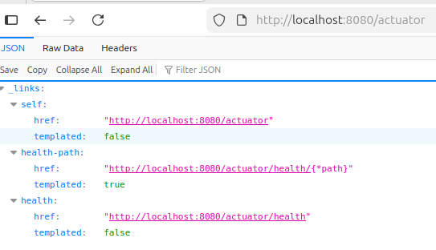
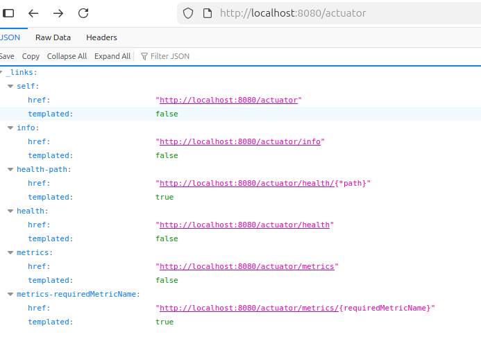
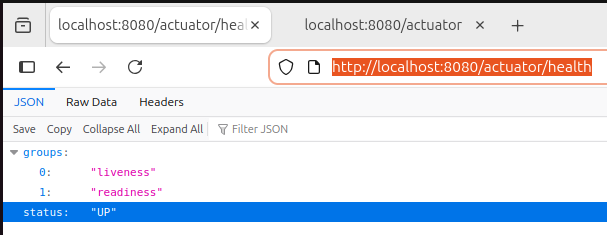
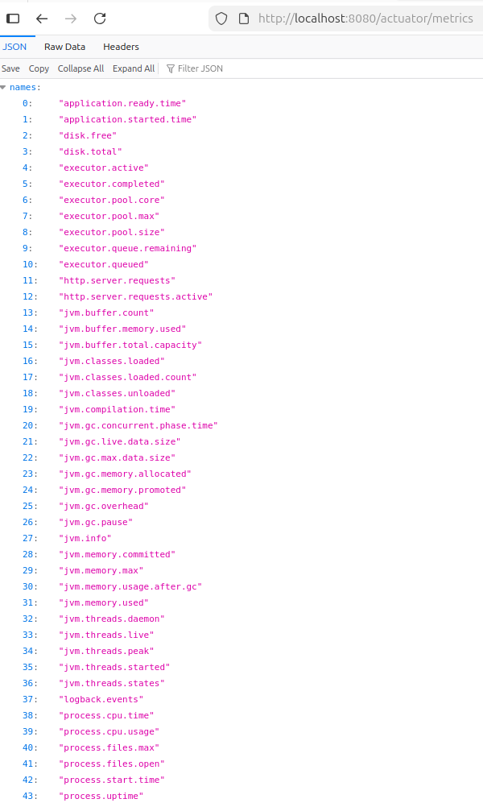
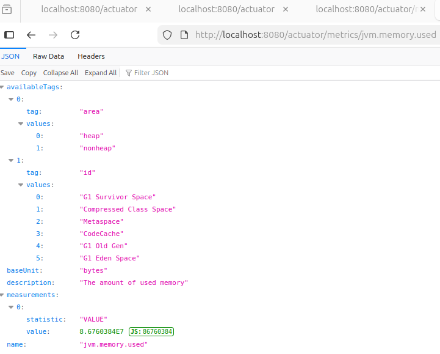
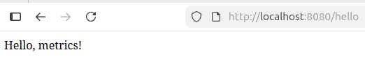
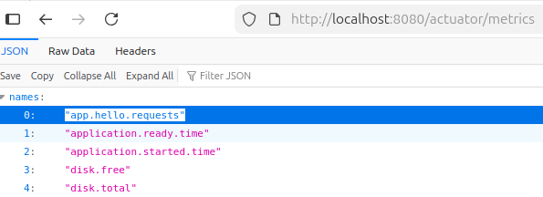
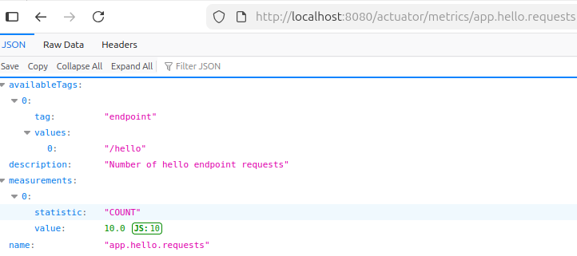
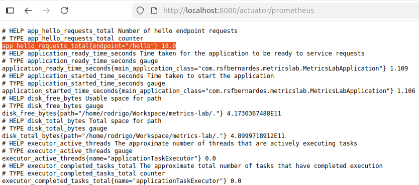
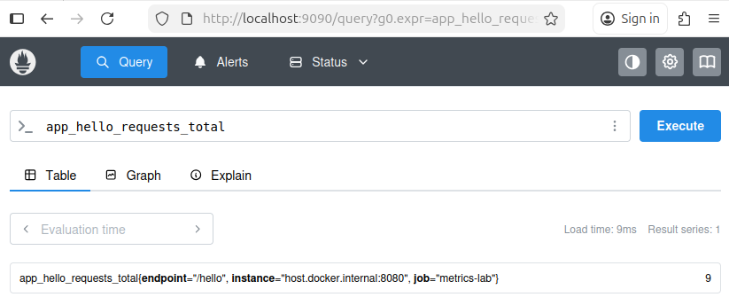

# Metrics Lab

This repository is a hands-on learning project focused on **observability with Spring Boot**, using
**Actuator, Micrometer, Prometheus, and Grafana**.

The main goal is to understand — step by step — how metrics are:
- created inside a Spring Boot application
- exposed through Actuator
- later collected and visualized by external systems

---

## 🛠️ Tech Stack

- Java 25 (Amazon Corretto)
- Spring Boot 4.0.1
- Gradle (Kotlin DSL)
- Spring Boot Actuator
- Micrometer (metrics facade)
- Docker (next steps)
- Prometheus & Grafana (next steps)

---

## 📌 What has been done so far

### Step 1 – Project setup

- Created a Spring Boot project using **Gradle with Kotlin DSL**
- Configured Java 25 using Amazon Corretto
- Added base dependencies:
    - Spring Web
    - Spring Boot Actuator
- Created and pushed a clean baseline repository to GitHub

This establishes a stable starting point for all future steps.

---

### Step 2 – Actuator exposure and metrics exploration

Before introducing Prometheus or any external monitoring tool, the focus was on
understanding what Spring Boot already provides **out of the box**.

At first, Actuator endpoints are **restricted by default**, exposing only minimal information.

---

## 🔍 Actuator behavior before and after configuration

By default, Spring Boot Actuator exposes only a minimal set of endpoints.
This behavior is intentional and aligned with production security best practices.

---

### Step 3 - Actuator root — default behavior

GET /actuator



At this stage, only a limited set of endpoints is visible.

---

## ⚙️ Actuator configuration

To safely explore metrics, a restricted set of endpoints was explicitly exposed
using `application.yml`:

```yaml
spring:
  application:
    name: metrics-lab

management:
  endpoints:
    web:
      exposure:
        include: health,info,metrics
```

Only the endpoints required for learning and validation were enabled.

---

## Actuator root — after configuration

After configuring `application.yml`, additional endpoints become visible:

```
GET /actuator
```



This confirms that Actuator exposure is **explicit and controlled**.

---

### Health endpoint

The health endpoint verifies that the application is running correctly:

```
GET /actuator/health
```



---

### Metrics endpoint

The **metrics endpoint** lists all metric names registered by **Micrometer**:
```
GET /actuator/metrics
```



At this stage, metrics already include:
- JVM memory and threads
- CPU usage
- HTTP server requests
- 
❗ No custom metrics were created yet.

---

### ☕ JVM Metric Example

Metrics can be queried individually. Example:

```
GET /actuator/metrics/jvm.memory.used
```



This endpoint shows:
- Current memory usage
- Available tags such as:
    - heap / non-heap
    - memory pools

---

### 🧠 Key Learnings So Far

- Metrics already exist **before** Prometheus or Grafana
- Spring Boot **autoconfigures Micrometer internally**
- Actuator is responsible for **exposing**, not **exporting**, metrics
- Metrics are composed of:
    - a **name**
    - one or more **measurements**
    - a set of **tags**
- HTTP and JVM metrics are available **without writing any metric-related code**

---

## 🚧 Next Steps

Planned improvements for this project include:

- Adding the Micrometer Prometheus registry
- Exposing the `/actuator/prometheus` endpoint
- Running Prometheus and Grafana using Docker
- Creating custom application-level metrics

Each step will be documented with configuration, validation, and learnings.

---

## 📊 Step 4 – Custom application metrics

In this step, a **custom application-level metric** was implemented to deepen the
understanding of how Micrometer works beyond Spring Boot’s autoconfigured metrics.

While JVM and HTTP metrics are provided out of the box, real observability requires
metrics that represent **explicit application behavior**. This step focuses on
creating, registering, and validating such a metric.

---

### 🎯 Objectives

- Define a custom Micrometer metric
- Register the metric using Spring Boot’s autoconfigured infrastructure
- Increment the metric from application code
- Validate the metric through Spring Boot Actuator
- Clarify the responsibilities of Micrometer vs Actuator

---

### 🛠 Implementation overview

A custom **Micrometer Counter** was created and registered explicitly using the
autoconfigured `MeterRegistry`. The metric is initialized once during application
startup and incremented every time a specific endpoint is called.

#### Metric definition

- **Name:** `app.hello.requests`
- **Type:** Counter
- **Description:** Number of requests handled by the `/hello` endpoint
- **Tags:**
  - `endpoint=hello`

This naming and tagging strategy follows Micrometer best practices and prepares the
metric for future aggregation and visualization.

---

### 🌐 Metric usage

A simple REST endpoint was created to represent application behavior and force
metric incrementation:

GET /hello



Each request to this endpoint increments the `app.hello.requests` counter, allowing
the metric to reflect real application traffic.

---

### 🔍 Validation via Actuator

The custom metric can be discovered and inspected using Spring Boot Actuator.

- List all available metrics:

GET /actuator/metrics



- Inspect the custom metric in detail:

GET /actuator/metrics/app.hello.requests




The response confirms that:

- The metric is correctly registered
- The counter value increases with each request
- Tags and measurements are exposed as expected

This validates that the metric lifecycle — registration, incrementation, and
exposure — is functioning correctly.

---

### 🧠 Key learnings

- Micrometer metrics are **defined in code**, not configuration
- A metric only exists after being registered in a `MeterRegistry`
- Spring Boot autoconfigures the `MeterRegistry`, making it directly injectable
- Actuator’s responsibility is **exposing metrics**, not creating them
- Custom metrics are independent of Prometheus or Grafana
- Metric naming and tagging decisions are foundational for effective observability

---

### 🚧 Next steps

The next steps focus on **exporting and visualizing** these metrics:

- Add the Micrometer Prometheus registry
- Expose the `/actuator/prometheus` endpoint
- Run Prometheus and Grafana using Docker
- Visualize both built-in and custom metrics in Grafana dashboards

Each step will be documented with configuration details, validation steps, and
key learnings.

## 📈 Prometheus metrics exposure

The Prometheus Micrometer registry was added to enable metric export in
Prometheus-compatible format.

### Endpoint

```
GET /actuator/prometheus
```




This endpoint exposes all application, JVM, and **custom metrics** using the
Prometheus exposition format.

**Custom** application metrics created earlier are visible alongside
autoconfigured metrics, confirming correct registry integration.

---

### 🚧 **What’s next** (Step 6 preview)

- Next step, we’ll finally bring **Prometheus** itself into the picture:
- Run Prometheus using **Docker**
- Configure `prometheus.yml`
- Scrape your application
- Verify targets and metrics

---

### 📝 Commit conventions

Early commits in this repository reflect an exploratory learning phase.

From **Step 4 onward**, this project follows the
[Conventional Commits](https://www.conventionalcommits.org/) specification
to keep commit history consistent and portfolio-ready.

---

### 📡 Step 6 – Running Prometheus with Docker & scraping the application

In this step, Prometheus itself was finally introduced into the architecture.
Until now, metrics were only exposed by the application. Here, they start
being actively collected by an external system.

This step focuses on understanding:
- how Prometheus runs
- how it discovers targets
- how scraping actually works over time

---

### 🐳 Prometheus with Docker

Prometheus was executed using Docker, keeping the local environment isolated
and reproducible.

A custom prometheus.yml configuration file was created and mounted into the
container. This file defines what Prometheus scrapes and how often.

---

### ⚙️ Prometheus configuration (`prometheus.yml`)

Key configuration elements:

```
global:
  scrape_interval: 15s

scrape_configs:
  - job_name: "metrics-lab"
    metrics_path: "/actuator/prometheus"
    static_configs:
      - targets:
          - host.docker.internal:8080
```

Explanation:
- `scrape_interval`: how often Prometheus pulls metrics from the target
- `job_name`: logical grouping for the scraped application
- `metrics_path`: Actuator Prometheus endpoint
- `targets`: application address accessible from the Docker container

This configuration tells Prometheus to **pull metrics every 15 seconds** from
the Spring Boot application.

---

### 🎯 Target validation


After starting Prometheus, the application appeared in the `Targets` page:
- Target status: **UP**
- Last scrape: successful
- No scrape errors

This confirms that:
- networking between Docker and the host is correct
- the `/actuator/prometheus` endpoint is reachable
- metrics are being collected successfully

---

### 🔍 Prometheus UI & PromQL basics



Using the Prometheus UI, metrics were queried using `PromQL`.

Important clarification discovered in this step:

Prometheus does **not** update metrics when a query is executed.

Instead:
- Metrics are collected only during scrapes
- PromQL queries simply read stored time-series data
- Re-executing a query only refreshes the visualization

---

### ⏱ Understanding metric frequency

Metric values increase because:
- Prometheus scrapes the application at fixed intervals
- Each scrape stores a new data point
- Counters increase only when the application performs work (e.g. HTTP requests)

If no requests happen between scrapes:
- The metric value remains unchanged
- Prometheus still stores repeated samples with the same value

This explains why metrics don’t “auto-update” on screen without re-running the query.

---

🧠 Key learnings

Prometheus uses a pull model, not push

Scraping is time-based, independent of user interaction

PromQL queries do not trigger metric updates

Metrics are stored as time-series, not single values

Counters represent accumulated events over time

Understanding scraping is essential before using rate() or Grafana

### 🚧 Next steps

With metrics now being scraped and stored, the foundation is ready for
visualization.

Upcoming steps:
- Introduce **Grafana**
- Connect Grafana to Prometheus
- Create dashboards for:
  - JVM metrics
  - HTTP metrics
  - Custom application metrics

Use `rate()` and `increase()` correctly

At this point, the project transitions from `observability plumbing
to real observability insights` 📊🚀

---

